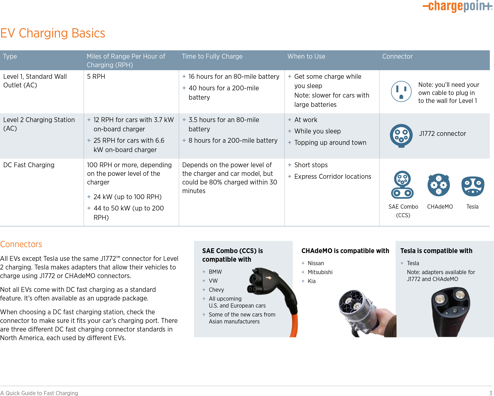
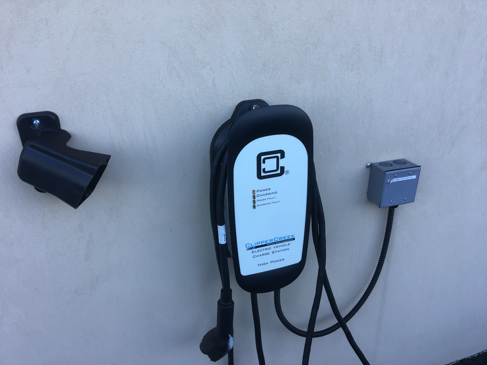
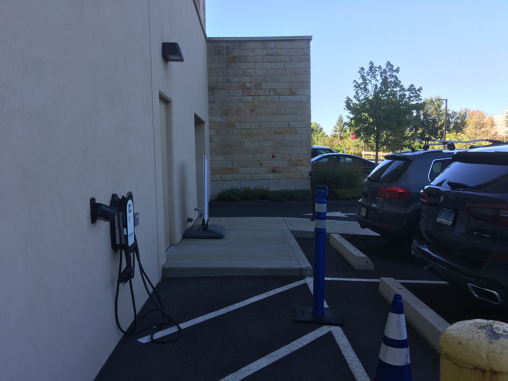
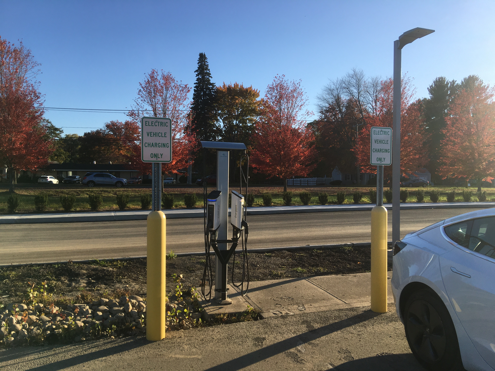
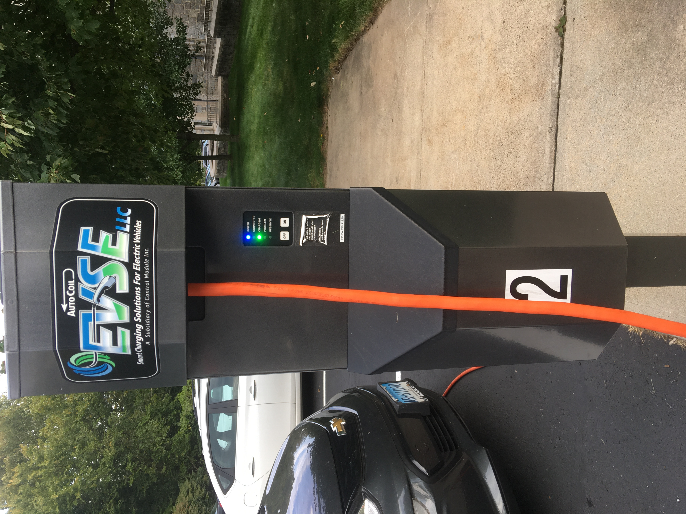
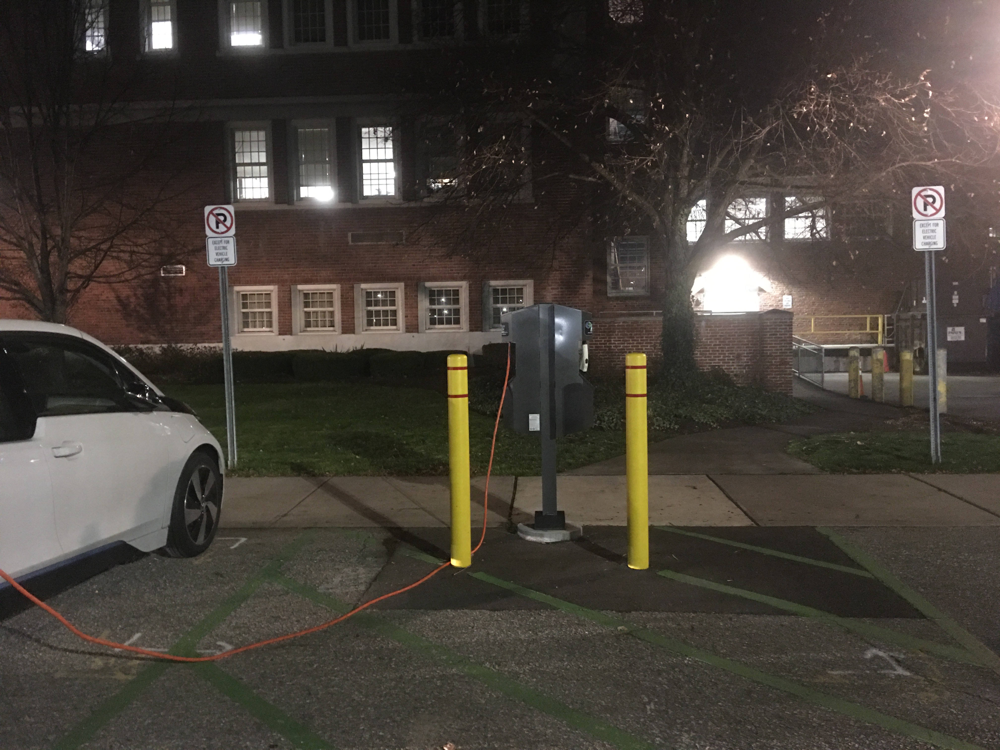
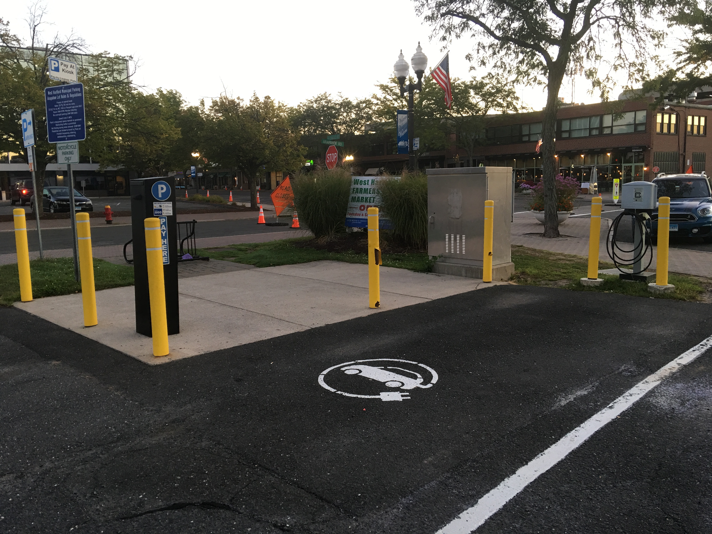
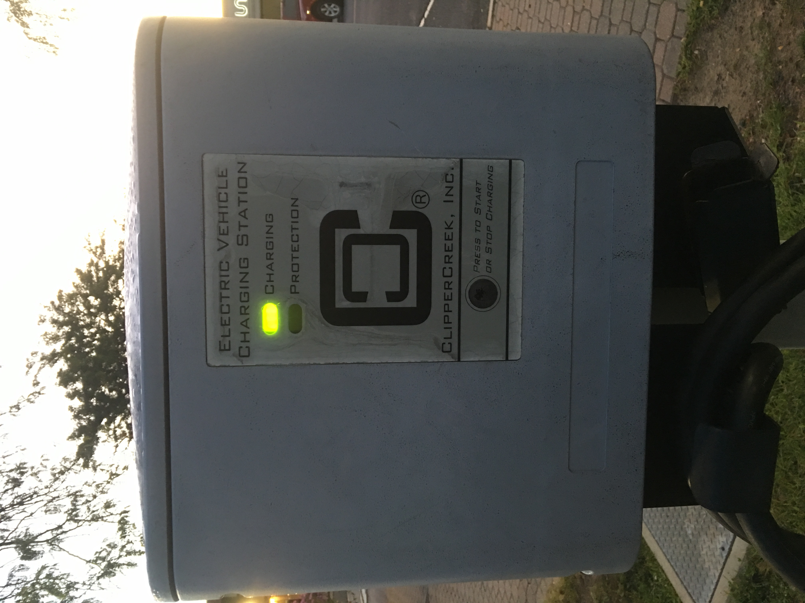

autoscale: true
slidenumbers: true
theme: Simple by Roy Vanegas, 1
build-lists: true

# A Proposal for EV Chargers on the Main UHart Campus

#### Roy Vanegas, Assistant Professor, Dept of Computing Sciences, University of Hartford
#### 5 December 2019

---

## Acronyms
* **DEEP**: Dept of Energy and Environmental Protection
* **NEMA**: National Electrical Manufacturers Association
* **EVSE**: Electric Vehicle Supply Equipment (charging station and associated equipment)
* **RPH**: Range per Hour
* **HEV**: Hybrid Electric Vehicle (Prius)
* **PHEV**: Plug-In Hybrid Electric Vehicle (Prius Prime)
* **EV**: Electric Vehicle (Tesla)
* **BEV**: Battery Electric Vehicle, also known as an EV (Tesla)

---

## HEV Note
Any discussion about charging vehicles in this deck does not pertain to HEVs — or hybrids, as they’re more commonly known — as the electricity required to recharge these vechicle’s on-board battery isn’t supplied by EVSE.

---

## A Partial List of Local Colleges/Universities With EV Chargers?
| School | Amt of Chargers | Public or Private | Fee | Comment |
|--------|:---------------:|:-----------------:|:---:|:-------:|
| [Asnuntuck Community College](https://asnuntuck.edu/acc-has-free-electric-vehicle-charging-station/)   | 1       | Public | Free | None |
| [Trinity College](https://www.trincoll.edu/sustainability/climate-change/)                             | 4       | Public | Free | None |
| [Western Connecticut State University](https://www.wcsu.edu/news-archives/evchargingstations/)         | 4       | Public | Free | None |
| [Wesleyan University](https://www.wesleyan.edu/sustainability/initiatives/transportation/options.html) | 10      | Mostly private; public discouraged | Free | Mainly for use by the Wesleyan community. Public users must obtain a parking permit or have their vehicle im-mobilized. |
| [UConn at Storrs and the School of Law](https://ecohusky.uconn.edu/electric-vehicles/)                 | Various | Public | Free | The UConn Law School has 2 chargers and the Storrs campus has 2 or more chargers.

---

## Who Has EV Chargers in the West Hartford Environs?
Perhaps the most interesting attitude towards EV chargers on campus comes from Wesleyan:

> “Add additional electric vehicle charging stations somewhere more central to campus, possibly by admissions. This would serve as a sign of Wesleyan's commitment to sustainability for visitors and potential students, and would encourage more faculty/staff to purchase hybrid and electric vehicles. The two chargers located by athletics are almost always in use, so clearly there is a demand for this on campus. I believe there is also still state money available to subsidize the project.”
-- [Completed, Best Practices Committee](https://www.wesleyan.edu/bestpractices/projects/completed.html) | Wesleyan University

---

## So, Why is Charging Free in Most Places?
* CT [provides incentives](https://afdc.energy.gov/laws/11497)[^1] to offset the cost of EVSE installation.
* In exchange for the subsidy, the state requires that the site provides free EV charging to the public.
* Hence, free EV charging at places like The UConn Law School Library and Trinity College’s Crescent St parking lot, among other locations throughout Hartford.
* Paul Kritzler, Environmental Analyst at DEEP, said that CT is also receiving funds from Volkswagen.
* He’s likely referring to the [VW Settlement Information](https://www.ct.gov/deep/cwp/view.asp?a=2684&q=587294&deepNav_GID=1619).
* Some VW funds are being awarded for EVSE installation. However, as of August 2019, there are no state incentives/subsidies.
* Kritzler said that subsidies may be reinstated in 2020, but was unsure as to a specific date.
* He advised me — and any interested parties — to [sign up](https://visitor.r20.constantcontact.com/manage/optin?v=001YIysmm7Zby2v8N7gpaNE4FHXjSP7wJj58Iys44A5Z6Z5NY-S8IYebvy6RlHJWPdbEsNxUKhJutkdfCeGJKbxpQ1ZHc7VfHHvGyVbLgM73G4%3D)[^2] for notifications.

[^1]: [https://afdc.energy.gov/laws/11497](https://afdc.energy.gov/laws/11497)

[^2]: [https://visitor.r20.constantcontact.com/manage/optin?v=001YIysmm7Zby2v8N7gpaNE4FHXjSP7wJj58Iys44A5Z6Z5NY-S8IYebvy6RlHJWPdbEsNxUKhJutkdfCeGJKbxpQ1ZHc7VfHHvGyVbLgM73G4%3D](https://visitor.r20.constantcontact.com/manage/optin?v=001YIysmm7Zby2v8N7gpaNE4FHXjSP7wJj58Iys44A5Z6Z5NY-S8IYebvy6RlHJWPdbEsNxUKhJutkdfCeGJKbxpQ1ZHc7VfHHvGyVbLgM73G4%3D)

---

## Charging Levels
There are currently three levels of charging, and each varies wildly from the others.

* **Level 1**: Slowest, at about $$1.8kWh$$, providing about 5 RPH.
* **Level 2**: Most common, at about $$9kWh$$, providing about 25 RPH.
* **Level 3**: Fastest, at about $$50kWh$$, providing about 138 RPH.[^3]

[^3]: Tesla superchargers and other Level 3 chargers provide up to 120$$kWh$$ of charging, providing about 333 RPH.

**Note**: These numbers are typical, but your mileage may vary.

---

## Form Factors
The most common form factors for charging interfaces in the US:

* **J1772** (Level 1 and Level 2)
* **CCS 1** (Level 3)
* **CHAdeMO** (Level 3)[^4] [^5]

[^4]: “CHAdeMO” is a pun on “O cha demo ikaga desuka” in Japanese, meaning, “Let’s have a tea while charging” in English.

[^5]: **Source**: [http://www.tepco.co.jp/en/press/corp-com/release/betu10_e/images/100315e1.pdf](http://www.tepco.co.jp/en/press/corp-com/release/betu10_e/images/100315e1.pdf)

---

## Form Factors

Source: [Driver’s Checklist: A Quick Guide to Fast Charging](https://www.chargepoint.com/files/Quick_Guide_to_Fast_Charging.pdf)

---

## Some Basic Electric Math
* $$amps \times volts = watts$$.
* A typical household outlet provides about $$15amps$$ at $$120volts$$.
* Thus, $$15amps \times 120volts = 1800watts$$ per hour, or $$1.8kWh$$.

---

## How Much Does the Consumer Pay for EV Charging at Home, Which is Level 1?
* Eversource charges me about $$\$0.19$$ per $$kWh$$, and all the outlets in my apartment [^6] supply about $$1800watts$$, or $$1.8kWh$$.
* Thus, $$1.8kWh \times \$0.19 = \$.34$$.

[^6]: A typical, Type B household plug, also known as a NEMA 5-15.

---

## How Much Electricity Does an EV Need to Travel One Mile?
* Charging my car for one hour ($$1800watts$$) from a standard plug provides me with $$5$$ miles of range.
* Therefore, 1 mile of range requires $$\frac{1800watts}{5miles} = 360watts$$.

---

## How Much Does the Consumer Pay for EV Charging on the Road, Which is Level 2?
* Every Level 1 or Level 2 charger I’ve visited in NY and CT, whether at a school or otherwise, has provided free charging.
* I have, however, paid for parking in lots that provide EV charging. For example:
   — *NY (Kew Gardens)*: $$\$3$$ for the first hour; $$\$2$$ each additional.
   — *CT (Blue Back Square)*: $$\$1.50$$ per hour.

---

## Partial List of Local EV Chargers

---

## Partial List of Local EV Chargers

**Location**: Delamar West Hartford

**Brand**: Clipper Creek

**Charger count**: 1

---

## Partial List of Local EV Chargers

**Location**: Delamar West Hartford

**Brand**: Clipper Creek

**Charger count**: 1

---

## Partial List of Local EV Chargers

**Location**: Bloomfield Human Services Community Center

**Brand**: SemaConnect

**Charger count**: 2

---

## Partial List of Local EV Chargers

**Location**: Bloomfield Human Services Community Center

**Brand**: SemaConnect

**Charger count**: 2

---

## Partial List of Local EV Chargers

**Location**: University of Connecticut School of Law

**Brand**: EVSE LLC

**Charger count**: 2

---

## Partial List of Local EV Chargers

**Location**: West Hartford Town Hall

**Brand**: EVSE LLC

**Charger count**: 2

---

## Partial List of Local EV Chargers

**Location**: Public parking, Arapahoe Rd at LaSalle Rd

**Brand**: Clipper Creek

**Charger count**: 1

---

## Partial List of Local EV Chargers

**Location**: Public parking, Arapahoe Rd at LaSalle Rd

**Brand**: Clipper Creek

**Charger count**: 1

---

## Partial List of Local EV Chargers

**Location**: Bishops Corner

**Brand**: ChargePoint

**Charger count**: 2

---

## Interesting Facts
* San Mateo Community College in California has 61 EV chargers. [Stanford has 132!](https://www.eastbaytimes.com/2019/08/19/uc-berkeley-only-has-four-electric-vehicle-charging-spots-heres-how-other-bay-area-colleges-stack-up/)
* [Rivian](https://rivian.com/) is making an all electric pick up truck. Amazon [ordered 100,000](https://www.trucks.com/2019/09/30/rivian-electric-trucks-ready-launch/).
* Ford just introduced the [2021 all-electric Mustang Mach-E](https://www.ford.com/suvs/mach-e/2021/).

---

## Useful Links

* The US Dept of Energy’s [Costs Associated With Non-Residential Electric Vehicle Supply Equipment](https://afdc.energy.gov/files/u/publication/evse_cost_report_2015.pdf)

   *Published in late 2015, this document answers just about any question one may have regarding the installation of EVSE onto non-residential properties. Appendix C: Electricity Consumption Examples on Page 38 provides examples of pricing and power consumption use.* **§**

* *[Capitol Clean Cities of Connecticut](http://ct-ccc.org/wp/)*

   *The local Clean Cities coalition that brings together a network of contacts in the EV industry.* **§**

* *[EVConnecticut Charging Resources](https://www.ct.gov/deep/cwp/view.asp?a=2684&q=562474&deepNav_GID=2183)* by Dept of Energy & Environmental Protection (DEEP)

   *“The resources on this page will help you explore various types of charging station equipment and also provide very useful information on siting a charging station and signage requirements.”*

   **Source**: First paragraph at [EVConnecticut Charging Resources](https://www.ct.gov/deep/cwp/view.asp?a=2684&q=562474&deepNav_GID=2183). **§**
